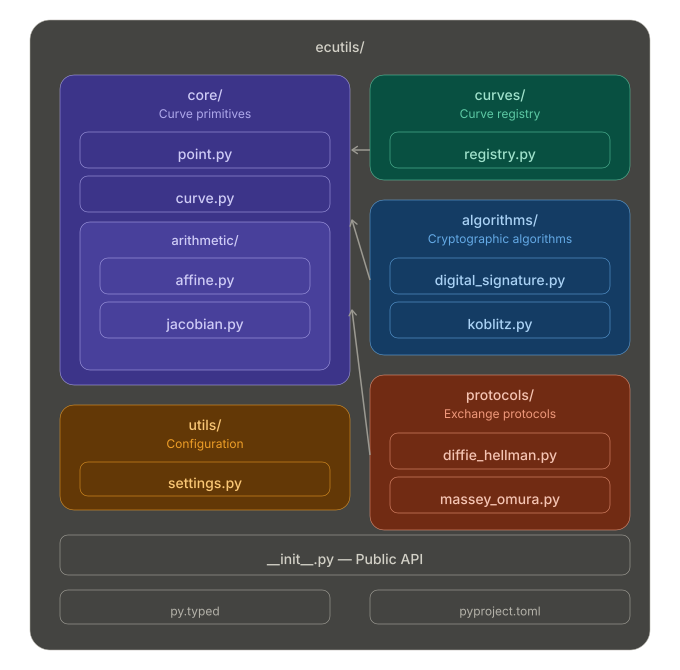

# ECUtils Documentation

Welcome to the documentation for ECUtils, a pure Python library for elliptic curve cryptography (ECC). ECUtils provides a clean and straightforward interface for common ECC operations, algorithms, and protocols.

## Quick Start

```python
from ecutils import DigitalSignature

# Generate a signature instance with a private key
private_key = 123456789
ds = DigitalSignature(private_key, curve_name="secp256k1")

# Sign a message (SHA-256 hashing is done automatically)
r, s = ds.sign_message(b"Hello, ECUtils!")

# Verify the signature
is_valid = ds.verify_message(ds.public_key, b"Hello, ECUtils!", r, s)
print(f"Valid: {is_valid}")  # Output: Valid: True
```

## Module Structure



## Documentation Overview

### Getting Started

- **[Installation](installation.md):** How to install ECUtils via pip or from source.
- **[Usage Guide](usage.md):** Practical examples for common use cases.
- **[Configuration](configuration.md):** Customize cache size and coordinate systems.

### API Reference

- **[Core](reference/core.md):** `Point`, `CurveParams`, and `CoordinateSystem` for fundamental operations.
- **[Algorithms](reference/algorithms.md):** `DigitalSignature` (ECDSA) and `Koblitz` encoding.
- **[Protocols](reference/protocols.md):** `DiffieHellman` (ECDH) and `MasseyOmura` key exchange.
- **[Curves](reference/curves.md):** Pre-defined curve parameters and registry functions.
- **[Utils](reference/utils.md):** Configuration settings and math utilities.

### Advanced Topics

- **[Mathematical Background](math-background.md):** Elliptic curve theory, formulas, and educational examples.
- **[Benchmarks](benchmarks.md):** Performance data across configurations and curves.
- **[Security Considerations](security.md):** Best practices for secure implementations.

## Features

| Feature | Description |
|---------|-------------|
| **Core Operations** | Point addition, subtraction, negation, scalar multiplication via operators (`+`, `-`, `*`) |
| **Point Compression** | Compress points to (x, parity) and decompress back |
| **Curve Validation** | Automatic discriminant check (4a³ + 27b² ≠ 0) rejects singular curves |
| **Digital Signatures** | ECDSA sign/verify with optional integrated SHA-256 hashing (`sign_message`/`verify_message`) |
| **Key Exchange** | Diffie-Hellman (ECDH), Massey-Omura |
| **Message Encoding** | Koblitz method |
| **Math Utilities** | Quadratic residue testing (Euler criterion) and modular square root (Tonelli-Shanks) |
| **Supported Curves** | secp192k1/r1, secp224k1/r1, secp256k1/r1, secp384r1, secp521r1 |
| **Performance** | LRU caching, Jacobian coordinates |

## Supported Curves

| Curve | Key Size | Common Use |
|-------|----------|------------|
| secp192k1 | 192-bit | Legacy |
| secp192r1 | 192-bit | NIST P-192 |
| secp224k1 | 224-bit | Legacy |
| secp224r1 | 224-bit | NIST P-224 |
| secp256k1 | 256-bit | Bitcoin, Ethereum |
| secp256r1 | 256-bit | TLS, NIST P-256 |
| secp384r1 | 384-bit | NIST P-384 |
| secp521r1 | 521-bit | NIST P-521 |

## License

ECUtils is available under the [MIT License](https://opensource.org/licenses/MIT).

## Language-Specific Libraries for Elliptic Curve Cryptography

In addition to the Python module, there are other language-specific libraries available for elliptic curve cryptography:

- **JavaScript Library for Elliptic Curve Cryptography**: The `js-ecutils` package provides elliptic curve functionalities tailored for JavaScript developers. You can find it on [GitHub](https://github.com/isakruas/js-ecutils).

- **Go Library for Elliptic Curve Cryptography**: The `go-ecutils` library offers similar elliptic curve utilities for Go developers. More information and documentation can be found on [GitHub](https://github.com/isakruas/go-ecutils).
